# 基于springboot的洗衣店订单管理系统

<h4 style='color:red'>联系不到我，就看我的主页 </h4> 
 
#### 介绍

基于Spring Boot的洗衣店订单管理系统是一个为现代洗衣店量身定制的综合管理平台。该平台充分利用了Spring Boot框架的灵活性和可扩展性，为洗衣店提供了从订单管理、客户服务到店铺运营等一系列功能。系统通过明确的角色划分（管理端、店家端、用户端），不仅提高了工作效率，还极大地优化了用户体验，使洗衣店的日常运营更加顺畅高效。

#### 技术栈

后端技术栈：Springboot+Mysql+Maven

前端技术栈：Vue+Html+Css+Javascript+ElementUI

开发工具：Idea+Vscode+Navicate

#### 系统功能介绍

1. 管理端  
个人中心：管理员可以方便地管理自己的个人信息、登录状态以及权限设置，确保系统的安全性和稳定性。  
顾客管理：管理员可以全面管理顾客信息，包括注册、审核、信息更新等，从而了解顾客需求，为店铺提供个性化服务。  
店家管理：管理员对注册的店家进行审核、管理和监督，确保店铺服务质量和规范性。  
店铺信息管理：管理所有店铺的基本信息，如地址、联系方式、营业时间等，便于顾客查询和选择。  
衣服类型管理：根据市场需求和店铺实际情况，定义和管理不同的衣物类型，方便顾客选择。  
洗衣信息管理：制定和管理洗衣服务的价格、时长、优惠活动等规则，满足不同顾客的需求。  
订单信息管理：管理员可以实时查看订单状态、订单详情，对异常订单进行及时处理，确保订单流程的顺畅。  
订单进度管理：监控订单的处理进度，确保服务及时完成，提高顾客满意度。  
交流区：提供管理员与店家、用户之间的交流平台，收集反馈意见，不断优化系统功能和服务。  

2. 店家端  
店铺信息：展示店铺的基本信息，包括地址、联系方式、服务特色等，吸引顾客关注和选择。  
交流区：与顾客、管理员进行交流，解答疑问，增强顾客信任感。  
系统公告：查看系统发布的最新公告、通知，了解行业动态和平台更新。  
个人中心：管理店家自己的登录信息、联系方式等，确保账号安全。  
在线客服：提供在线咨询服务，解答顾客疑问，提供专业建议。  
店铺信息管理：编辑店铺的营业时间、服务内容、优惠活动等，满足顾客多样化需求。  
衣服类型管理：根据店铺实际情况，管理可提供的衣物类型，确保服务质量。  
洗衣信息管理：设置店铺的洗衣价格、服务说明等，展示店铺特色。  
订单信息管理：接收并处理顾客订单，查看订单详情，确保订单准确无误。  
订单进度管理：更新订单处理进度，及时通知顾客，提高顾客满意度。  

3. 用户端  
店铺信息：用户可以查看店铺的地址、联系方式、服务评价等，选择心仪的店铺进行下单。  
交流区：与店家、其他顾客进行交流，分享洗衣经验，增进互动和了解。  
系统公告：查看系统发布的公告、通知，了解最新优惠活动和行业动态。  
个人中心：管理用户的个人信息、订单记录、收藏夹等，方便查看和管理。  
在线客服：与店家客服进行实时沟通，咨询洗衣服务相关问题，获得专业解答。  
洗衣信息管理：查看洗衣服务的价格、时长、说明等信息，了解服务详情。  
订单信息管理：用户可以轻松下单、查看订单详情、评价订单等，享受便捷的洗衣服务。  
订单进度管理：用户可以查看订单的处理进度，了解订单状态，确保服务及时完成。  

#### 系统作用

提高管理效率：管理端通过集中管理，可以实时监控订单状态，快速处理异常情况。  
优化服务体验：店家端提供详细的店铺信息和客服服务，用户可以更直观地了解店铺情况，获得更好的服务体验。  
促进交流互动：交流区提供了用户、店家、管理员之间的交流平台，有助于增强用户粘性，提高服务满意度。  

#### 系统功能介绍

代码结构

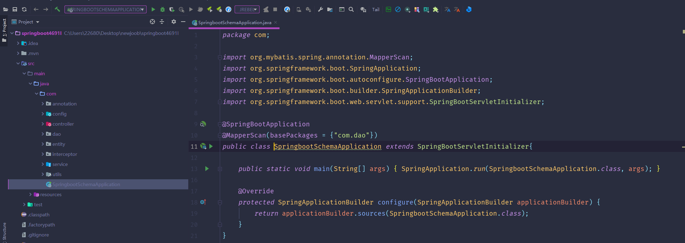

数据库表

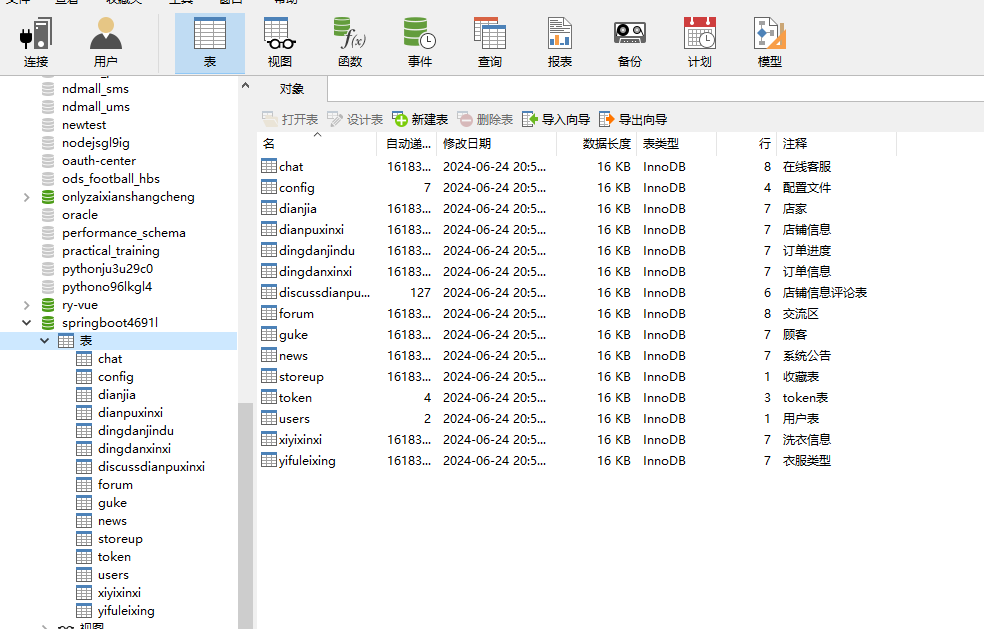

登录

顾客管理

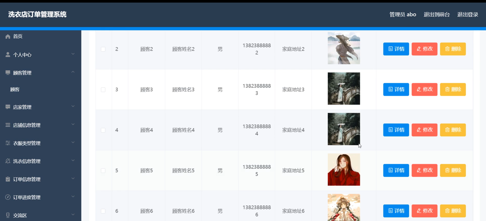

店家管理

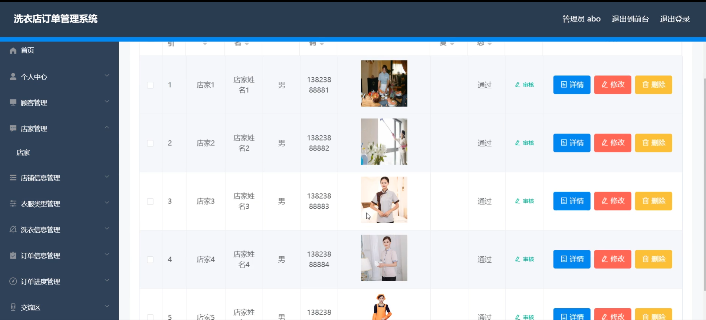

店铺信息管理

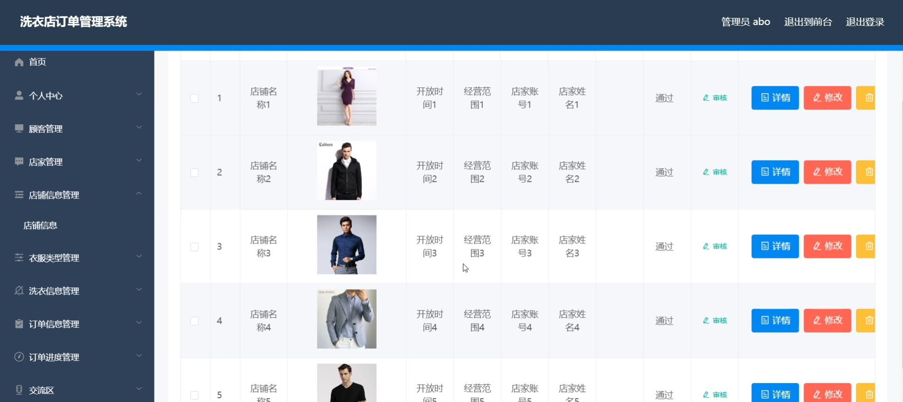

订单信息管理

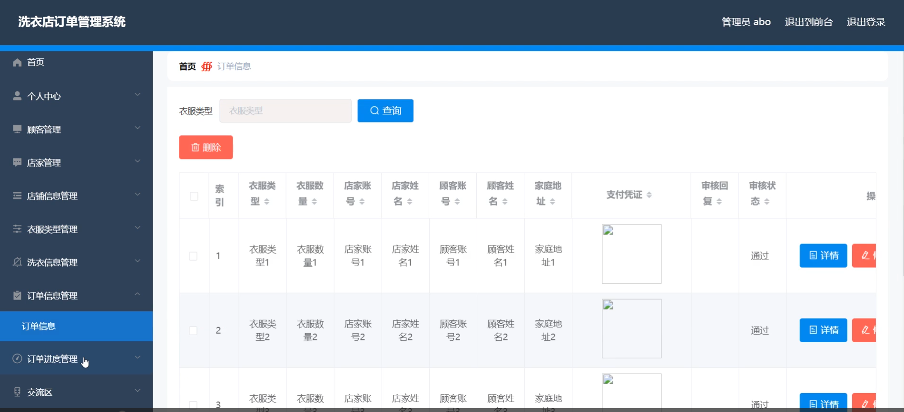

店家端后台管理

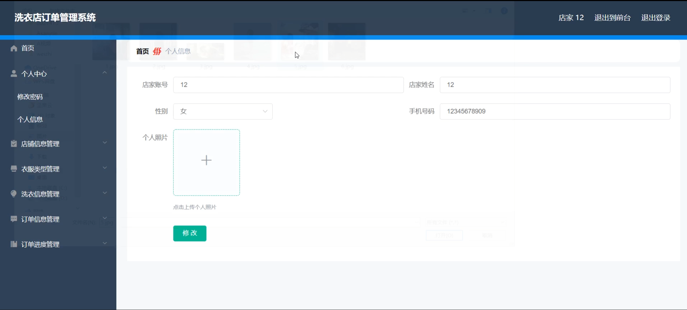

前台页面管理

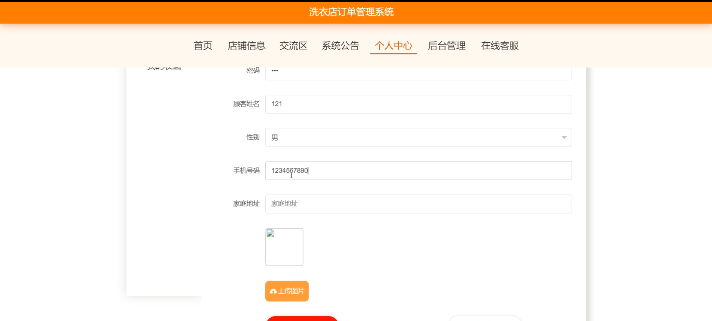

交流区

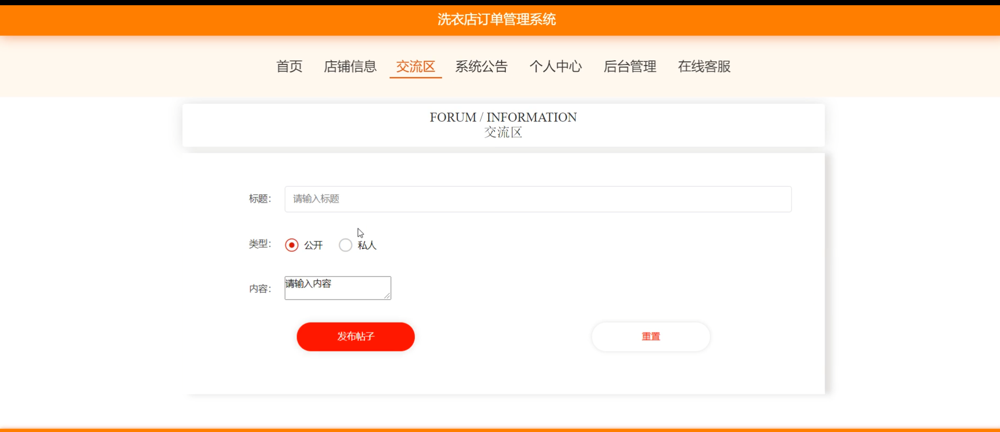

在线客服

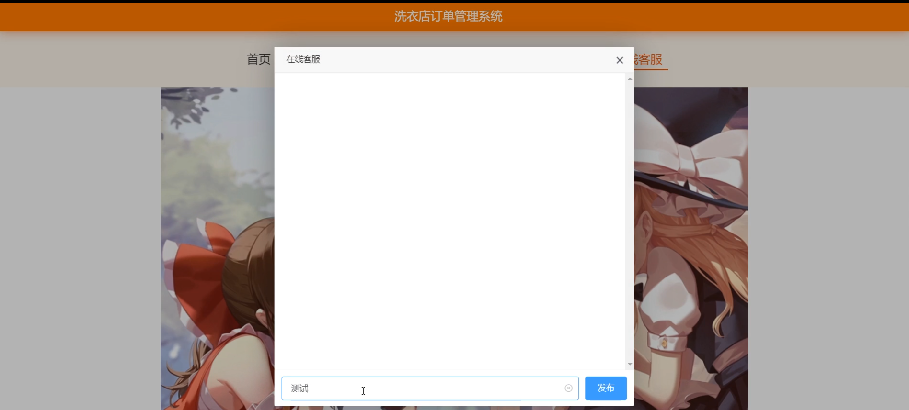

顾客端后台管理

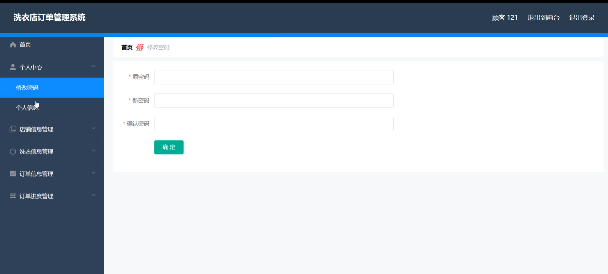

洗衣信息管理

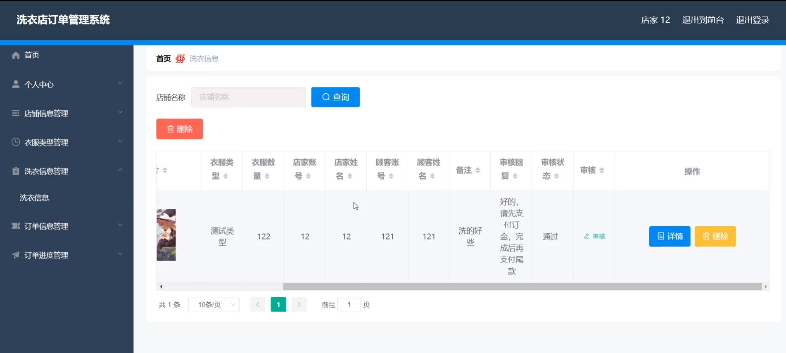

#### 总结

基于Spring Boot的洗衣店订单管理系统是一个功能全面、操作便捷、用户友好的管理平台。该系统通过明确的角色划分和精细化的功能设计，不仅提高了洗衣店的管理效率和服务质量，还优化了顾客的服务体验，促进了店家与顾客之间的互动和交流。未来，该系统将继续优化和完善功能，为洗衣店和顾客带来更多便利和好处。

#### 使用说明

创建数据库，执行数据库脚本 修改jdbc数据库连接参数 下载安装maven依赖jar 启动idea中的springboot项目

后台地址：http://localhost:8080/springboot4691l/admin/dist/index.html

管理员  abo 密码 abo

前台地址：http://localhost:8080/springboot4691l/front/index.html